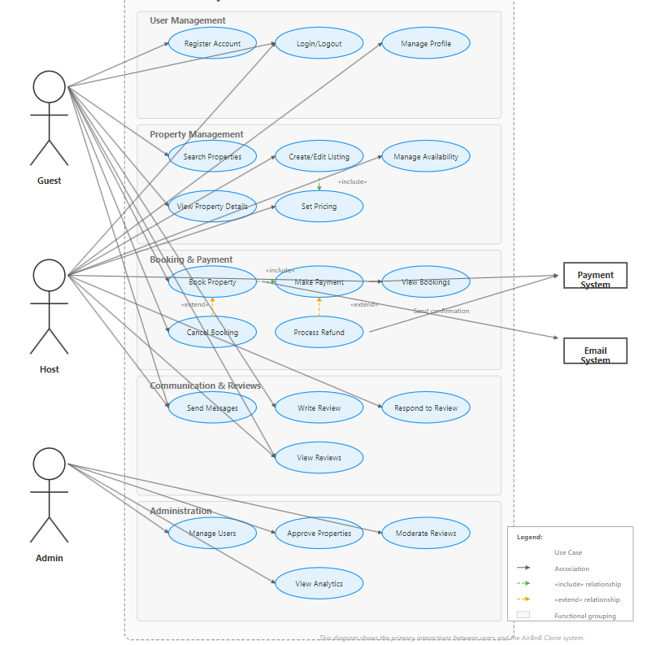

# AirBnB Clone - Use Case Diagram

This document explains the use case diagram for the AirBnB Clone application, detailing the interactions between the system and its users.

---

## Overview

The use case diagram visualizes how different actors (users and external systems) interact with the AirBnB Clone platform. It illustrates the key functionalities from each user's perspective and the relationships between various system features.

---

## Actors

The diagram identifies the following primary actors:

- **Guest** – Users who browse properties and make bookings  
- **Host** – Users who list and manage their properties  
- **Admin** – System administrators who oversee platform operations  
- **Payment System** – External payment processing service  
- **Email System** – External notification service  

---

## Use Cases

### Guest Use Cases

#### Account Management

- Register Account  
- Login  
- Manage Profile  

#### Property Discovery

- Search Properties  
- View Property Details  
- View Reviews  

#### Booking Management

- Book Property  
- Manage Bookings  
- Cancel Booking  
- Make Payment  
- Request Refund  

#### Engagement

- Write Review  
- Send Messages  

---

### Host Use Cases

#### Account Management

- Login  
- Manage Profile  

#### Property Management

- Create Property Listing  
- Manage Property  
- Set Availability  
- Set Pricing  

#### Engagement

- Respond to Reviews  
- Send Messages  

---

### Admin Use Cases

#### User Management

- Manage Users  

#### Content Oversight

- Approve Properties  
- Monitor Bookings  
- Moderate Reviews  

#### System Administration

- View Analytics  
- Manage System Settings  

---

## Relationships

The diagram includes two types of relationships between use cases:

- **Include Relationships (`<<include>>`)** – Indicate that one use case necessarily includes the behavior of another use case:
  - `Book Property` includes `Make Payment`  
  - `Manage Property` includes `Set Pricing` and `Set Availability`  

- **Extend Relationships (`<<extend>>`)** – Indicate that one use case may conditionally extend another:
  - `Cancel Booking` extends `Manage Bookings`  
  - `Request Refund` extends `Book Property`  

---

## External System Interactions

The diagram shows how the AirBnB Clone system interacts with external systems:

### Payment System

- Process payments for bookings  
- Handle refund requests  

### Email System

- Send booking confirmations  
- Deliver notifications and alerts  

---

## Key Workflows

### Property Booking Flow

1. Guest searches for properties  
2. Guest views property details  
3. Guest books property  
4. System processes payment  
5. System sends booking confirmation  

### Property Listing Flow

1. Host creates property listing  
2. Host sets availability calendar  
3. Host configures pricing  
4. Admin approves property  
5. Property becomes available for booking  

### Review Process

1. Guest stays at property  
2. Guest writes review  
3. Host responds to review  
4. Admin moderates reviews if necessary  

---

## Notes on the Diagram

- For clarity, not all possible interactions between actors and use cases are shown  
- Some administrative functions are simplified  
- The diagram focuses on core business functionalities rather than technical implementations  

---

## Use Case Diagram

